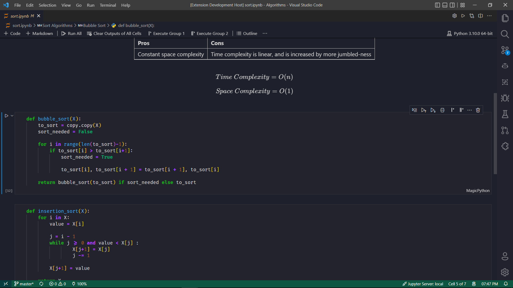
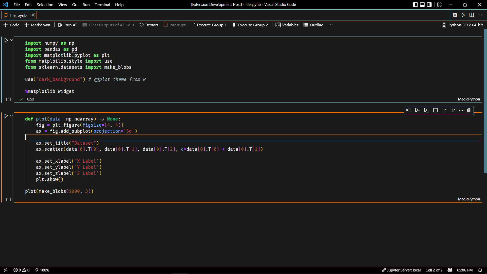

# Jupyter Theme

    The theme seen in Jupyter Notebooks, for VS Code,
    to seemlessly integrate your Jupyter workflows right
    down to the colour theme. It includes light, dark
    and high contrast themes!
    
    Works beautifully on Windows 🏠, MacOS 🍎, Linux 🐧
    and on the Web 🌐!

 

 

## Light Theme

 

 

## Dark Theme

 

 

## Light High Contrast Theme

 

 

## Dark High Contrast Theme

 

 

Thanks for installing 😊! Keep on coding 👩‍💻!